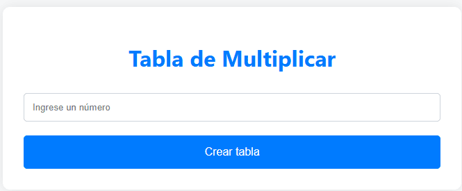

# Generador de Tabla de Multiplicar

Esta actividad web es una aplicación interactiva que permite a los usuarios generar una tabla de multiplicar para cualquier número entero ingresado. Utiliza HTML y CSS para la interfaz de usuario y PHP para procesar y mostrar la tabla de multiplicar.

  

El script PHP procesa los datos ingresados en el formulario:

- **Obtención de Datos:** Recibe el número ingresado a través de $\_GET.

- **Generación de la Tabla de Multiplicar:** Utiliza un bucle for para calcular y mostrar los resultados de la multiplicación del número ingresado por los números del 1 al 12.

- **Presentación de la Tabla:** Imprime la tabla de multiplicar en formato HTML.

Esta actividad demuestra habilidades en el desarrollo de aplicaciones web interactivas utilizando tecnologías de front-end y back-end. La aplicación ofrece una funcionalidad práctica y una interfaz de usuario intuitiva, facilitando la generación y visualización de tablas de multiplicar de manera eficiente.

**Consulta la versión preliminar de la actividad aquí:** [https://ejercicio_06.com](https://alejandrovillegas.net/projects/exercise-06/index.php)

# 📌 Información de la Actividad

Esta actividad ha sido desarrollado como parte del portafolio de soluciones tecnológicas, con el objetivo de ofrecer una herramienta eficiente y funcional para usuarios autodidactas interesados en la gestión y desarrollo de proyectos web.

- **Área**: Desarrollo de Actividades Web

- **Usuario Final**: TecNM

- **Fecha de Desarrollo**: 29 de junio de 2018

- **Portafolio de Proyectos**: [www.alejandrovillegas.net](https://www.alejandrovillegas.net/)

## 🔧 Guía de Instalación y Configuración de la Actividad

1. Descargue y descomprima el archivo del proyecto en su sistema local.

La actividad ahora está funcionando en su entorno local. 🎉
